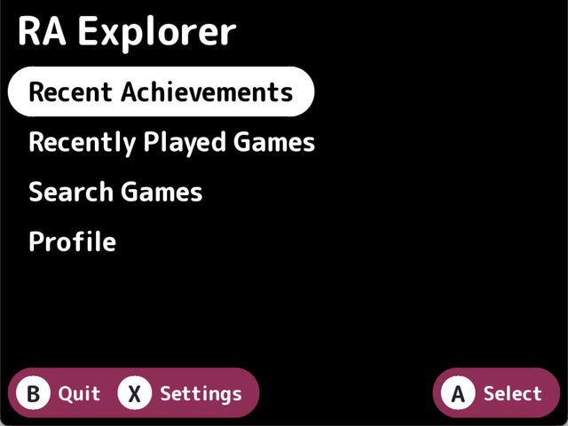
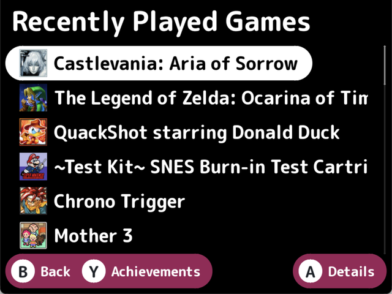
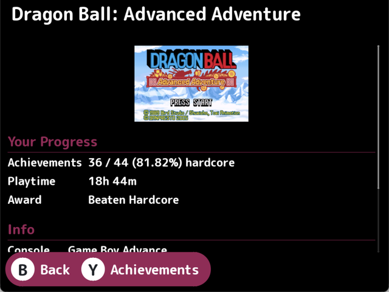
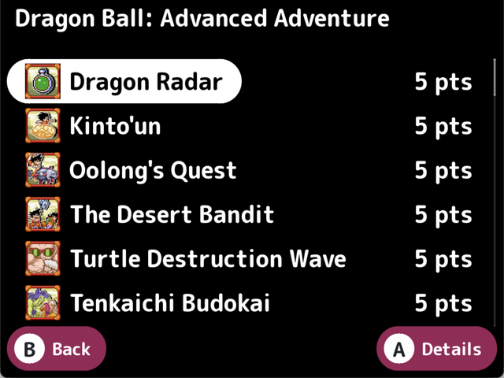
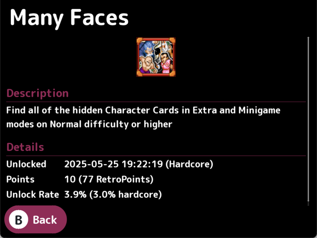
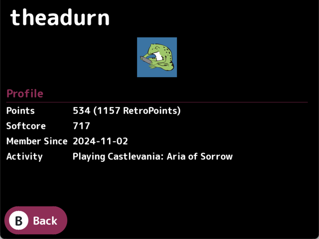

# RA Explorer

A RetroAchievements browser for NextUI handhelds. Shows your profile, recent
achievements, recently played games and their achievement lists, and lets you
search the RetroAchievements game library.

Built with [Apostrophe](https://github.com/Helaas/Apostrophe), a C UI toolkit
for NextUI.

This project has been created with the assistance of Claude Code.

## Screenshots

|  |  |
|:--|:--|
| **Main menu** | **Recently played games** |
|  |  |
| **Game details** | **Achievements** |
|  |  |
| **Achievement details** | **Profile** |
|  |  |

## Screens

| Screen | Contents |
|---|---|
| Recent Achievements | Achievements unlocked in the last six months, newest first |
| Recently Played Games | Your recent games, opening progress and achievement lists |
| Search Games | Search the library by title |
| Profile | Points, membership date and current activity |
| Settings | Username, API key, sort order, image cache |

Buttons follow one rule throughout: **A** opens whatever the cursor is on, and
**Y** jumps sideways to related context (from a game to its achievements, or
from an achievement to its game). **B** goes back.

## Requirements

- [Meson](https://mesonbuild.com/) and Ninja
- [Task](https://taskfile.dev/)
- SDL2, SDL2_ttf, SDL2_image and libcurl, for native builds
- Docker, for device builds

## Building

```
task build     # native, for development
task run       # native, and launch it
```

Device builds run inside the NextUI toolchain container, selected by
`PLATFORM` — `my355` (Miyoo Flip), `tg5040` (TrimUI Brick / Smart Pro) or
`tg5050` (Smart Pro S). It defaults to `my355`.

```
task device PLATFORM=tg5040    # cross-compile
task pak PLATFORM=tg5040       # assemble the Pak
task adb PLATFORM=tg5040       # build, assemble and push over adb
task package                   # build all three, zip into dist/RA.Explorer.pakz
```

The first device build also compiles curl and OpenSSL, which takes a bit
longer. Later builds reuse them.

## Installation

### Via Pak Store (recommended)

1. Open **Pak Store** on your NextUI device.
2. Search for **RA Explorer** and install it.
3. Pak Store downloads the latest `RA.Explorer.pakz` release and places the Pak
   in the correct `Tools/<platform>/RA Explorer.pak/` directory for your device.

### Manual installation

1. Download `RA.Explorer.pakz` from the
   [latest release](https://github.com/apommel/nextui-ra-explorer/releases).
2. Extract the archive to the root of your SD card. It will create the correct
   directory structure:

   ```
   Tools/
   ├── my355/RA Explorer.pak/
   ├── tg5040/RA Explorer.pak/
   └── tg5050/RA Explorer.pak/
   ```

   Each `RA Explorer.pak/` folder contains `launch.sh`, `cacert.pem`,
   `LICENSE.txt`, `THIRD-PARTY-NOTICES.txt`, and the stripped `ra-explorer`
   binary for that platform.

### First run

Open Settings and enter your RetroAchievements username and web API key, found
on the RetroAchievements website under Settings > Applications. Saving verifies
them against the site.

Settings are stored in `settings.json` under `$SHARED_USERDATA_PATH/ra-explorer`
on device, or `~/.userdata/ra-explorer` otherwise, and can be edited there
directly. Downloaded icons are cached alongside it in `images/`; Settings shows
how much space they use and can clear them.

## Licence

RA Explorer is MIT licensed; see `LICENSE.txt`.

The Pak also contains statically linked components under their own terms —
Apostrophe and cJSON (MIT), curl (curl licence) and OpenSSL (Apache-2.0) — plus
a CA certificate bundle derived from Mozilla's root store. Their licences are
reproduced in `THIRD-PARTY-NOTICES.txt`, which ships alongside. SDL2 and its
companions are linked dynamically and supplied by the device, so they are not
redistributed here.

## Layout

```
src/app/      screens, settings, lazy list icons
src/ra_api/   RetroAchievements HTTP client, endpoints, image cache
src/util/     paths
cross/        Meson cross files, one per device plus a shared base
docker/       toolchain image with Meson added
pak/          launch.sh and notices, copied into the Pak
```

Dependencies are Meson subprojects: Apostrophe and cJSON on every build, curl
and OpenSSL only when cross-compiling, since the device sysroot ships neither a
libcurl nor a current OpenSSL. Device binaries link those statically, so the
Pak is a single executable whose only shared dependencies are SDL2, SDL2_ttf,
SDL2_image and the base system libraries the device already has.
